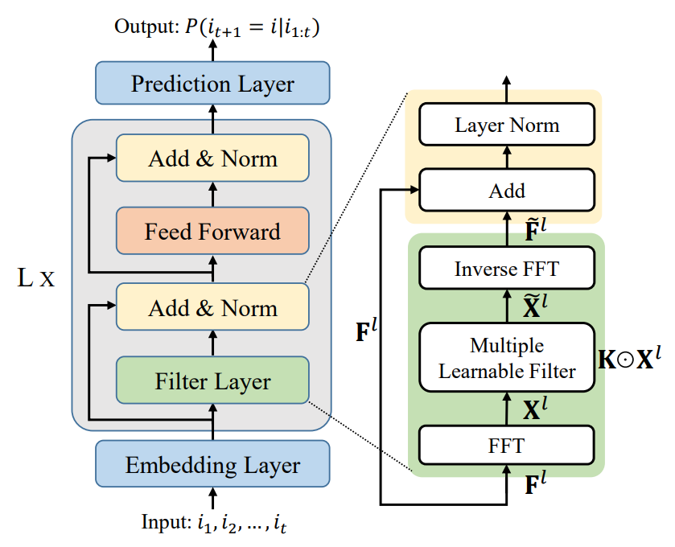

# FMLP-Rec
The source code for our WWW 2022 Paper [**"Filter-enhanced MLP is All You Need for Sequential Recommendation"**]()


## Requirements
* Install Python, Pytorch(>=1.8). We use Python 3.7, Pytorch 1.8.
* If you plan to use GPU computation, install CUDA.

## Overview
**FMLP-Rec** stacks multiple **Filter-enhanced Blocks** to produce the representation of sequential user preference for recommendation. The key difference between our approach and SASRec is to replace the multi-head self-attention structure in Transformer with a novel filter structure. You can transform FMLP-Rec to SASRec, by adding `--no_filters` parameter when running code.



## Datasets
We use eight datasets in our paper, all of which have been uploaded to [Google Drive](https://drive.google.com/drive/folders/1omfrWZiYwmj3eFpIpb-8O29wbt4SVGzP?usp=sharing)
 and [Baidu Netdisk](https://pan.baidu.com/s/1we2eJ_Vz9SM33PoRqPNijQ?pwd=kzq2).

The downloaded dataset should be placed in the `data` folder, furthermore, session-based dataset should be placed in a folder named after the dataset.

If you want to use your own dataset, please follow the steps below:
1. Prepare a file with user_ids and each follows 99 negative samples, and name it with `YOUR_DATASTES_sample.txt`. For session-based dataset, only validation set and test set need to be sampled.
2. Place your dataset and sample file in the `data` folder. For session-based dataset, a folder named after the dataset is needed.
3. Add the name of your dataset to the data list in utils.py, according to the data type. 


## Quick-Start
If you have downloaded the source codes, you can train the model just with data_name input.
```
python main.py --data_name=[data_name]
```

If you want to change the parameters, just set the additional command parameters as you need. For example:
```
python main.py --data_name=Beauty --num_hidden_layers=4 --batch_size=512
```

You can also test the model has been saved by command line.
```
python main.py --data_name=Beauty --do_eval --load_model=FMLPRec-Beauty-4eval
```

Additional hyper-parameters can be specified, and detailed information can be accessed by:

```
python main.py --help
```

## Contact
If you have any questions for our paper or codes, please send an email to ishyu@outlook.com.

## Acknowledgement 
Our code is developed based on [S3-Rec](https://github.com/RUCAIBox/CIKM2020-S3Rec)*